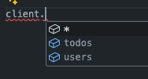

# Hono RPC Example

This is a simple Hono RPC example of a Deno runtime server and a Nodejs PNPM package manager client. Just wanted to see how awesome it is to type safe REST request from the client

## Note
- Using Deno for the server, make sure you add the `"nodeModulesDir": "auto"` to `deno.json` file in order for the types to be used in the client

